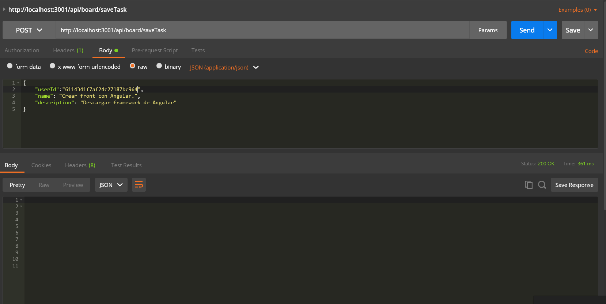
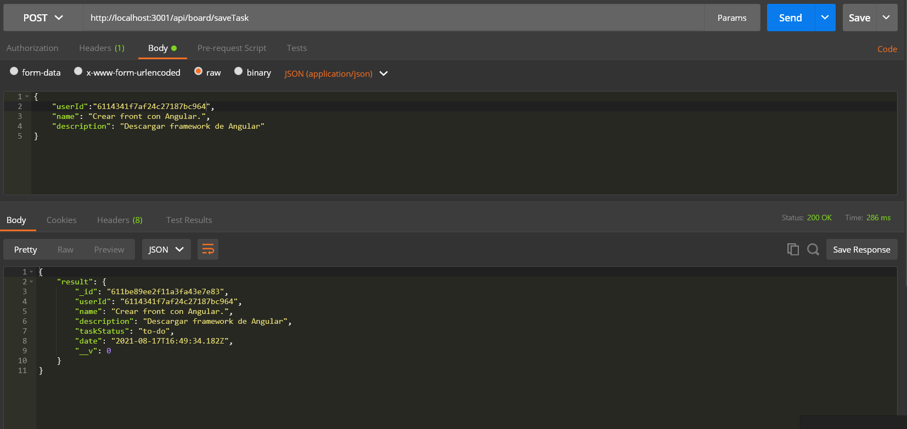
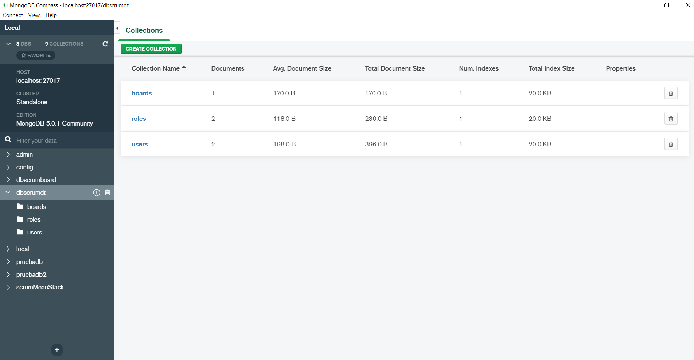

# Validación del proceso

## Productos

Visualización las colleciones roles y users creadas previamente en MongoDB por medio de compass:

1. Visualización la petición a saveTask:

2. Visualización de la respuesta:
 

3. Usuarios existentes para visualizar el idUser:
 

4. Creación de la nueva colección:
 