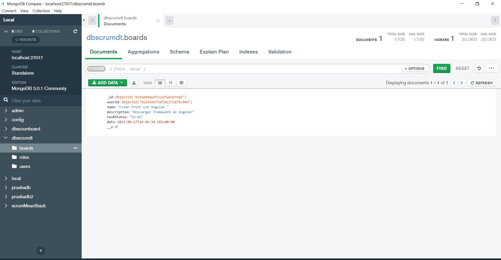
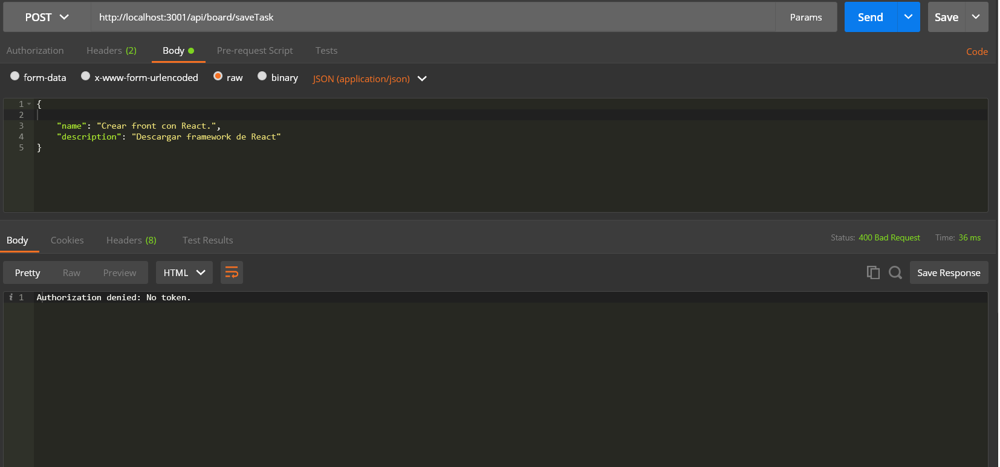
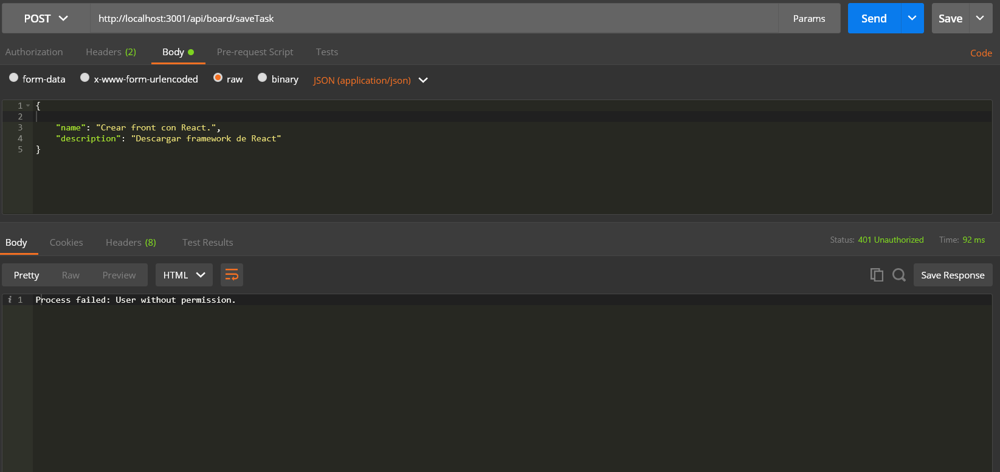
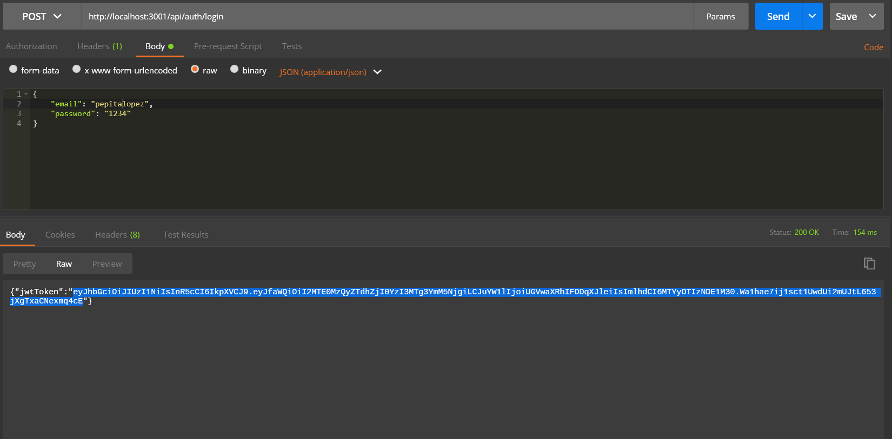
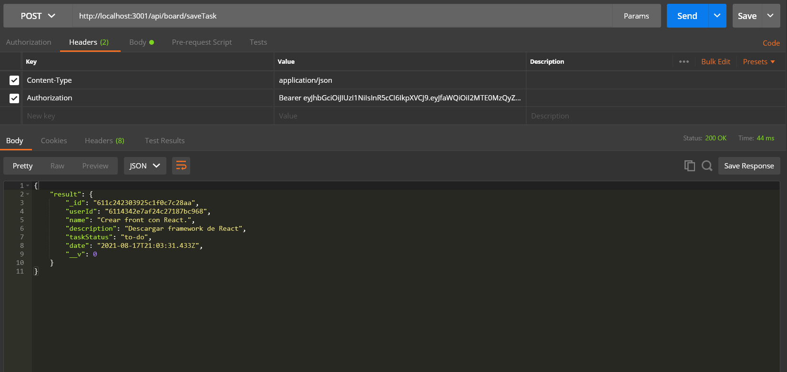
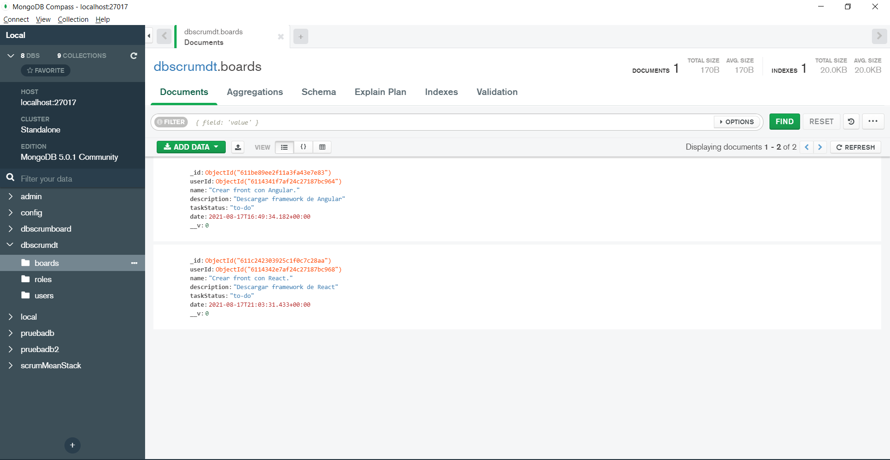

# Validación del proceso

## Tasks

Visualización de la colección antes de crear los registros con Middelware:

1. Visualización de error sin token:

2. Visualización de error sin permisos:
 

3. Token del usuario:
 

4. Creación de la nueva colección:
 

5.Visualización de la nueva colección:
 